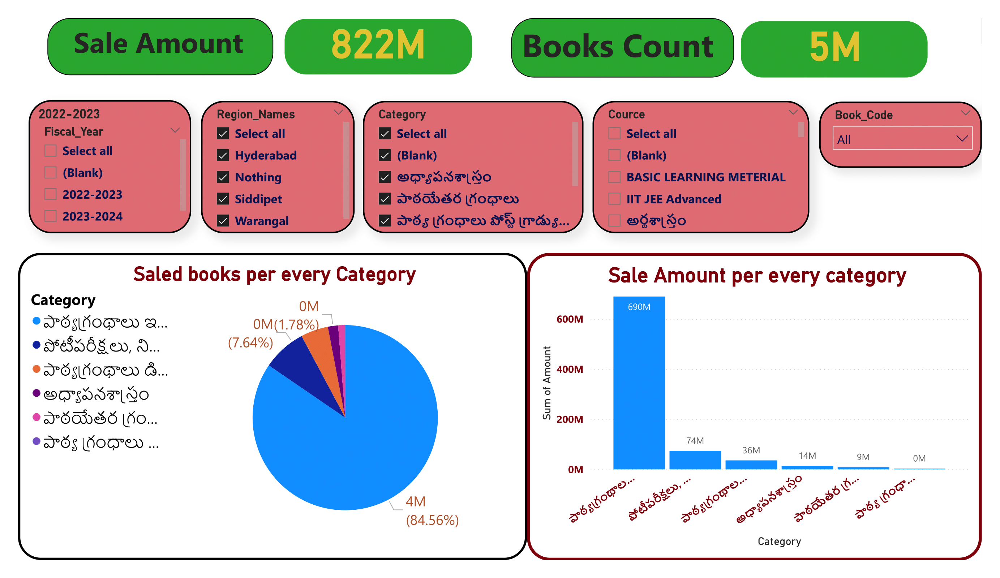
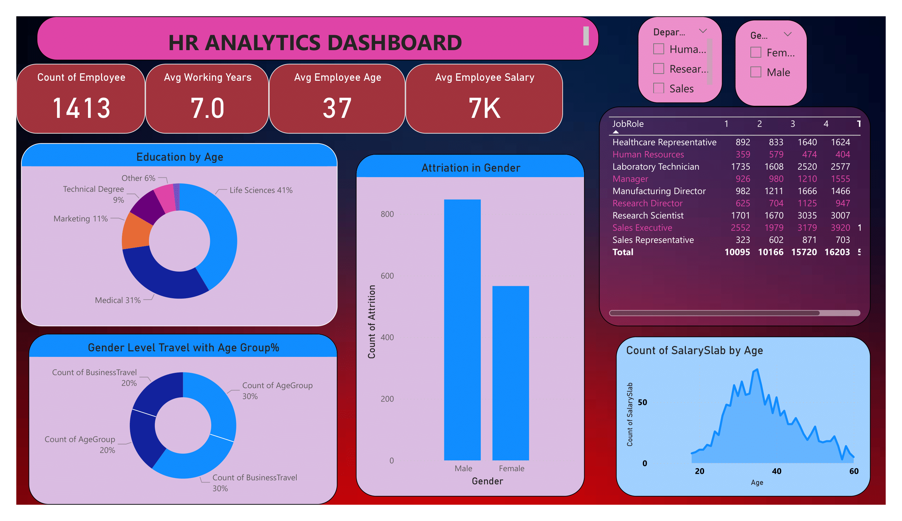

## About Me
A skilled .NET developer with 3.2 years of experience in application development and database management, now passionately focused on data analysis. Over the past year, I have honed skills in SQL, Excel, Power BI, and data visualization to drive data-driven decisions. Proficient in delivering solutions that enhance efficiency and support actionable insights.

## Technical Skills 
SQL | Power BI | Excel (Pivot Tables, Data Analysis) | SQL Server | Data Integrity | Data Visualization | Python (NumPy, Pandas) | MS Excel 

## Education
Bachelor of Science in Computers (Mathematics, Statistics, Computer Science) from St. Joseph’s Degree College (2014-2017).

## Work Experience

**Software Developer @ Neumeric Technologies Pvt. Ltd, Hyderabad (30th Sep,2021 to till date)**
**Project: Telugu Academy -Telangana Government**

•	Managed end-to-end data processes for procurement, inventory management, and sales in the ERP system, ensuring seamless operations.
•	Executed data tracking workflows for book printing logistics, including quantities, including quantities, pricing, and vendor details, supporting large – scale distribution to colleges.
•	Created real-time dashboards for inventory levels and sales trends, improving supply chain decisions.
•	Liaised with cross-functional teams to establish data standards and ensure reporting accuracy.

**Telugu Akademy Regional Centers Requiremnt From Gowdown For Three Finacial Years**

**MSRTC – Maharashtra Government**

•	Conducted data flow optimization and implemented automated reports for inventory usage and employee 
       and inventory management analytics. 
•	Collaborated with stakeholders to design  dashboards for executive decision-making, ensuring compliance with operational standards.

**Miami Beach – USA**

•	Conducted  Data Collection and analyze city maintenance needs and improvements Based on Category Ratings and 
        Questions Ratings.
•	Built custom dashboards and optimized SQL queries for real-time reporting .

**Sample Project of HR ANALYTICS PROJECT**

## Achievements
•	 Recognized by the Telugu Academy clients for prompt support and providing required insights and data, enhancing operational efficiency.
•	Awarded “Employee of the month” (sep,2024) for outstanding ERP system contributions, revenue generation, and exceptional accountability, nominated by Indian operational director.

## Certifications
•	Data science python (Beginner to expect) --By Udemy.
•	Exploratory Data Analysis Projects--By Great Learning 

<a href="17 How to Present Data to Executives by Anietie Etuk.pdf">Download the Report here (pdf file)</a>

## CONTACT DETAILS

*Let’s connect and see how we can make a difference together!*
<table>
  <tbody>
    <tr>
      <td>📧</td>
      <td><a href="mailto:kittukirankumar2015@gmail.com">kittukirankumar2015@gmail.com</a></td>
    </tr>
    <tr>
      <td>📞</td>
      <td>(+91) 9652339932</td>
    </tr>
    <tr>
      <td>📍</td>
      <td>Hyderabad</td>
    </tr>
    <tr>
      <td>⬇️</td>
      <td><a href="https://etuk123456.github.io/portfolio1/docs/Profile.pdf">Download my CV</a></td>
    </tr>
    <tr>
      <td>🌐</td>
      <td><a href="https://linkedin.com/in/etukanietie">The things I do daily on LinkedIn</a></td>
    </tr>
    <tr>
      <td>📺</td>
      <td><a href="https://www.youtube.com/@LearnwithEtuk">Watch my tutorials on YouTube</a></td>
    </tr>
  </tbody>
</table>
